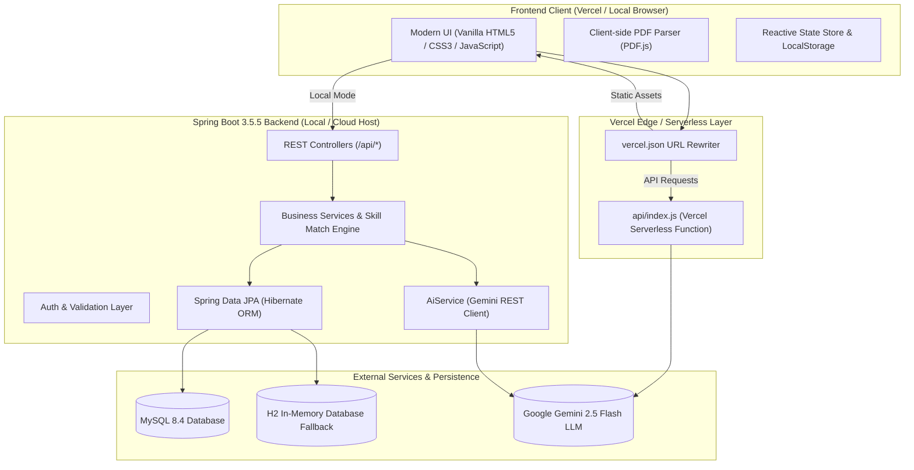
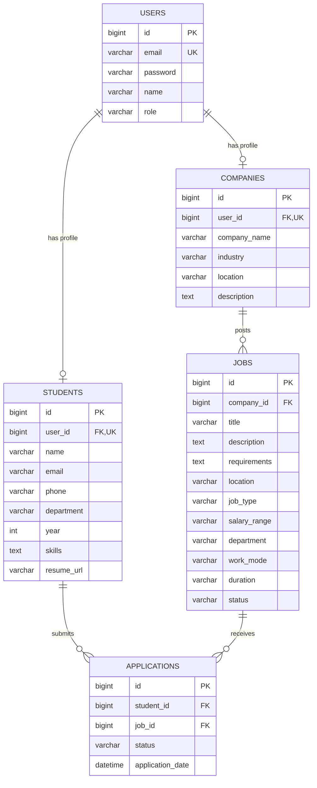

# 🎓 Smart Internship & Placement Portal

[](https://portal-nu-weld-82.vercel.app)
[](https://spring.io/projects/spring-boot)
[](https://www.oracle.com/java/)
[](https://www.mysql.com/)
[](https://ai.google.dev/)

An enterprise-ready, full-stack **Smart Internship and Placement Platform** tailored for engineering college students, recruiters, and placement cells. Features real-time job matching, dynamic branch filtering across 8 disciplines, multi-location search, stipend filters, and deep **Google Gemini AI integration** for career guidance, ATS scoring, and real resume media file analysis.

---

## 🌟 Live Demo & Deployment

* **Production URL**: **[https://portal-nu-weld-82.vercel.app](https://portal-nu-weld-82.vercel.app)**
* **Vercel Project Dashboard**: [kaushalthakare9-5120s-projects/portal](https://vercel.com/kaushalthakare9-5120s-projects/portal)

---

## 🏗️ System Architecture



---

## ✨ Key Features

### 1. 🎓 8 Engineering Streams & Disciplines
Dedicated filtering, opportunity categorization, and branch-specific recommendation tags:
* **CSE** (Computer Science & Engineering)
* **IT** (Information Technology)
* **COMP** (Computer Engineering)
* **AIDS** (Artificial Intelligence & Data Science)
* **AIML** (Artificial Intelligence & Machine Learning)
* **EXTC** (Electronics & Telecommunication)
* **MECHANICAL** (Mechanical Engineering)
* **CIVIL** (Civil Engineering)

### 2. ⚡ Dynamic Branch Skills
Selecting a department automatically populates the candidate's skills and refines opportunity suggestions:
* **AIML / AIDS**: *Python, PyTorch, Deep Learning, OpenCV, TensorFlow, Pandas*
* **CSE / IT / COMP**: *Java, Spring Boot, MySQL, React, REST APIs, Git, Docker*
* **EXTC**: *Embedded C, Microcontrollers, IoT, Arduino, Verilog, VLSI, MATLAB*
* **MECHANICAL**: *SolidWorks, AutoCAD, CATIA, GD&T, FEA, Robotics, PLC*
* **CIVIL**: *STAAD.Pro, AutoCAD, Structural Analysis, BIM, Revit, Surveying*

### 3. 📍 Multi-Location & Work Mode Preferences
* **Locations**: *Mumbai, Thane, Navi Mumbai, Airoli, Pune, Bengaluru, Chennai, Remote*.
* **Work Modes**: *Remote, On-site, Hybrid*.

### 4. 💰 Duration & Stipend / Salary Bands
* **Internships**: **₹5k – ₹10k**, **₹10k – ₹20k**, **₹20k – ₹30k**, **₹30k+ / month**.
* **Placements / Full-time**: **₹20k – ₹50k**, **₹50k – ₹1L**, **₹1L+ / month** (equivalent up to ₹16 LPA).
* **Durations**: **1–2 months**, **3–6 months**, **6+ months**, **Full-time**.

### 5. 📄 Real Resume Media Upload & In-Depth AI Analysis
* **Media Dropzone**: Upload real resume files (`.pdf`, `.docx`, `.txt`, `.rtf`, `.md`) or paste profile text.
* **Client-Side PDF Extraction**: Uses **PDF.js** to parse multi-page PDFs directly in the browser with zero upload lag.
* **ATS Compatibility Score**: Calculated out of 100 with recruiter readiness rating.
* **⚠️ Lacking Points & Critical Skill Gaps**: Highlights missing quantifiable metrics, absence of live portfolio/GitHub links, missing industry frameworks (Docker, CI/CD, testing), and ATS formatting flaws.
* **🎯 Suggested Opportunities**: Recommends real-world roles with company, location, and salary estimates tailored to the resume.
* **Skills & Roadmap**: Detects existing skills, highlights strengths, suggests projects, and recommends career paths.

### 6. 🤖 Gemini AI Integration
* **✨ AI Career Assistant**: Drawer interface for interview preparation, roadmap guidance, and technical concepts.
* **✨ AI Suggested Opportunities**: Generates 4–5 realistic roles matching any branch and filter criteria.
* **✨ Real-Time Job Match Explanations**: Explains candidate skill match percentage and recommends how to bridge missing skills for specific openings.

### 7. 👤 User Identity & Profile Persistence
* Registration persists real student data: **Name, Email, Phone, Department, Academic Year, and Key Skills**.
* No hardcoded demo values: logged-in user names and degree initials render across the dashboard, topbar, and profile.
* Interactive **✏️ Edit Profile** modal syncs updates to the database (`PUT /api/students/{id}`).

---

## 🗄️ Database Architecture & Schema

### Entity-Relationship Diagram



### Table Definitions & Constraints
1. **`users`**: Unique email constraint; stores encrypted passwords and role (`STUDENT`, `COMPANY`, `ADMIN`).
2. **`students`**: One-to-one foreign key with `users`; persists student identity, branch, phone, academic year, and skill sets.
3. **`companies`**: One-to-one foreign key with `users`; holds company profile, location, and industry sector.
4. **`jobs`**: Foreign key to `companies`; captures title, department stream, location, stipend/salary, work mode, and requirements.
5. **`applications`**: Unique composite constraint on `(student_id, job_id)` prevents duplicate applications; foreign keys reject cascading orphan records.

---

## 🚀 Getting Started Locally

### Prerequisites
* **Java 17+** (JDK 17 or higher)
* **Maven 3.9+**
* **Node.js 18+** (for Vercel CLI / optional frontend tooling)
* **MySQL 8.0+** (optional; embedded H2 is configured out of the box)
* **Python 3.x** (for lightweight local frontend server)

---

### Step 1: Clone Repository
```powershell
git clone https://github.com/Alpha5635/portal.git
cd portal
git checkout integration
```

---

### Step 2: Configure Environment Variables
Copy [.env.example](.env.example) to `.env`:
```powershell
Copy-Item .env.example .env
```

Configure your credentials in `.env`:
```properties
# MySQL Connection (Optional if using H2 profile)
DB_URL=jdbc:mysql://localhost:3306/placement_portal?createDatabaseIfNotExist=true&serverTimezone=UTC&allowPublicKeyRetrieval=true&useSSL=false
DB_USERNAME=root
DB_PASSWORD=your_mysql_password

# Google Gemini API Key
GEMINI_API_KEY=YOUR_GEMINI_API_KEY_HERE
```

---

### Step 3: Start the Backend

#### Option A: Run with Zero-Dependency In-Memory H2 Database (Default)
Starts instantly without requiring local MySQL services:
```powershell
mvn spring-boot:run "-Dspring-boot.run.profiles=h2"
```

#### Option B: Run with Real MySQL Database
1. Ensure MySQL is running on port 3306:
   ```sql
   CREATE DATABASE IF NOT EXISTS placement_portal;
   ```
2. Run the application:
   ```powershell
   mvn spring-boot:run
   ```

*The backend starts at `http://localhost:8081`.*

---

### Step 4: Start the Frontend
In a separate terminal:
```powershell
python -m http.server 3000 --directory frontend
```

*Open your browser to **[http://localhost:3000](http://localhost:3000)**.*

---

## ☁️ Deployment on Vercel

The portal is designed for seamless deployment on Vercel via Vercel Serverless Functions (`api/index.js`) and static frontend hosting.

### 1. Deploy via Vercel CLI
```powershell
# Login to Vercel
npx vercel login

# Set Gemini API Key on Vercel
npx vercel env add GEMINI_API_KEY production

# Deploy to Production
npx vercel --prod --yes
```

### 2. Serverless Architecture Configuration
[vercel.json](vercel.json) routes all API calls to the serverless backend while serving static assets:
```json
{
  "version": 2,
  "rewrites": [
    { "source": "/api/(.*)", "destination": "/api/index.js" },
    { "source": "/(.*)", "destination": "/frontend/$1" }
  ]
}
```

---

## 📡 REST API Reference

### 🔐 Authentication
| Method | Endpoint | Description |
| :--- | :--- | :--- |
| `POST` | `/api/auth/register` | Register new student or company with department, phone, year, and skills |
| `POST` | `/api/auth/login` | Authenticate user and return session token + profile data |

### 💼 Opportunities & Jobs
| Method | Endpoint | Description |
| :--- | :--- | :--- |
| `GET` | `/api/jobs` | Retrieve all active internship & placement postings |
| `GET` | `/api/jobs/{id}` | Get detailed opportunity view |
| `POST` | `/api/jobs` | Post new job opening (Company role required) |
| `POST` | `/api/jobs/{id}/match` | Calculate skill match percentage & generate AI explanation |

### 🤖 Gemini AI Features
| Method | Endpoint | Description |
| :--- | :--- | :--- |
| `POST` | `/api/ai/ask` | AI Career Assistant guidance for skills, interviews & roadmaps |
| `POST` | `/api/ai/suggest-opportunities` | Generate 4–5 personalized opportunities based on stream & filters |
| `POST` | `/api/ai/resume-analyze` | Analyze resume text/file: ATS Score, Lacking Points & Opportunities |

### 👤 Student Profiles & Applications
| Method | Endpoint | Description |
| :--- | :--- | :--- |
| `GET` | `/api/students/{id}` | Get student profile details |
| `GET` | `/api/students/by-user/{userId}` | Retrieve student profile by user ID |
| `PUT` | `/api/students/{id}` | Update student details, skills, and department |
| `POST` | `/api/applications/apply` | Submit job or internship application |
| `GET` | `/api/applications/my-applications` | List current candidate applications |

---

## 🧪 Testing

Execute the comprehensive automated test suite (31 tests covering CORS, controllers, DTOs, security, JPA, and AI services):
```powershell
mvn test
```

All 31 unit & integration tests pass with zero failures:
```text
Results:
Tests run: 31, Failures: 0, Errors: 0, Skipped: 0
BUILD SUCCESS
```

---

## 👥 Contributors & Branch Strategy

| Branch | Focus Area |
| :--- | :--- |
| **`main`** | **Authoritative production release branch with full documentation** |
| **`integration`** | **Active full-stack integration branch with verified Vercel & AI deployments** |
| `aryan-database` | Database schemas, DDL, constraints & entity mapping |
| `kaushal-backend` | Spring Boot REST API, Gemini AI service & JPA repositories |
| `tanishka-frontend`| Responsive UI components, client-side state & CSS architecture |

---

## 📄 License
This project is licensed under the [MIT License](LICENSE).
