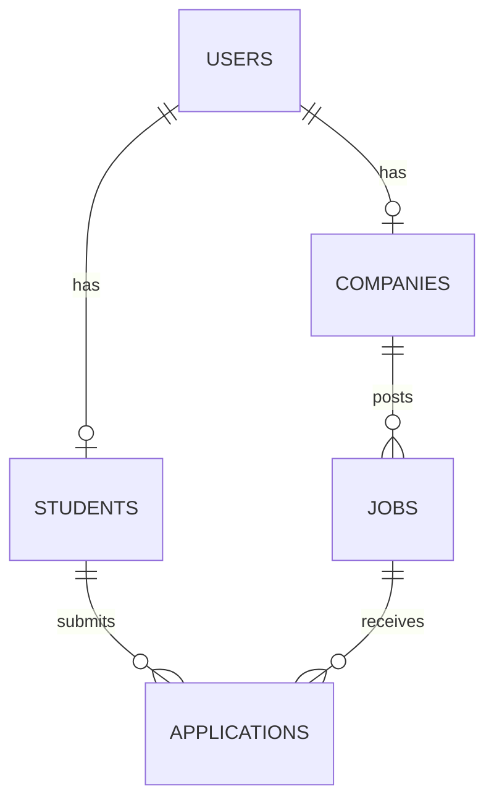

# Database Setup

This schema targets MySQL 8.4.9 and matches the Spring Boot entity model currently available on `origin/integration`.

## Local Configuration

The backend defaults to:

- Host: `localhost`
- Port: `3306`
- Database: `placement_portal`
- User: `root`
- Password: configured outside source control through `DB_PASSWORD`

Do not commit passwords, `.env` files, or other credentials.

## Run The Schema

From PowerShell, using the local MySQL installation:

```powershell
$mysql = Join-Path $env:LOCALAPPDATA 'SmartPortal\mysql\mysql-8.4.9-winx64\bin\mysql.exe'
& $mysql -u root < database/schema.sql
```

Or with a standard MySQL client:

```text
mysql -u root -p < database/schema.sql
```

## Tables

- `users`: login identity, email, hashed password, and role.
- `students`: one-to-one student profile linked to `users`.
- `companies`: one-to-one company profile linked to `users`.
- `jobs`: job or internship postings linked to `companies`.
- `applications`: student applications linked to `students` and `jobs`.

## Relationships



## Constraints And Indexes

- `users.email` is unique.
- `students.user_id` and `companies.user_id` are unique one-to-one foreign keys.
- `applications(student_id, job_id)` is unique to prevent duplicate applications.
- Foreign keys use InnoDB and reject deletion of companies/jobs/students that still have dependent records.
- Lookup indexes exist for company ownership, job status/deadline, application student/job/status, and company names.
- Role, job type, job status, and application status use MySQL `ENUM` values matching the Java enums and the tables generated by Hibernate.
- Passwords are stored only in the backend's password field; plaintext passwords must never be inserted.

## Contract Notes

The current Java entities do not define `created_at`, `updated_at`, company website/contact fields, or student education/profile fields. Those requested fields are intentionally absent from this schema so the database does not claim a contract the backend does not currently map. Add them only when the corresponding Java fields and migration plan exist.

The backend currently uses `spring.jpa.hibernate.ddl-auto=update`, but this checked-in schema is the authoritative reproducible database setup for local development.

For a non-destructive integration verification, override JPA to validate instead of update:

```powershell
$env:DB_URL = 'jdbc:mysql://localhost:3306/placement_portal?serverTimezone=UTC'
$env:DB_USERNAME = 'root'
$env:DB_PASSWORD = '<local password>'
mvn spring-boot:run "-Dspring-boot.run.arguments=--spring.jpa.hibernate.ddl-auto=validate"
```

Do not place the password in this file, in source control, or in a committed `.env` file. The checked-in backend defaults to the same URL and reads `DB_URL`, `DB_USERNAME`, and `DB_PASSWORD` when supplied.

## Validation

After applying the schema, verify the structure:

```sql
USE placement_portal;
SHOW TABLES;
SHOW CREATE TABLE users;
SHOW CREATE TABLE students;
SHOW CREATE TABLE companies;
SHOW CREATE TABLE jobs;
SHOW CREATE TABLE applications;
SHOW INDEX FROM users;
SHOW INDEX FROM applications;
```

The validation performed for this branch should also insert temporary users, profiles, a company job, and one application; attempt the same application twice to confirm the unique constraint, then remove the temporary records in dependency order.

## Stage 2 Integration Verification

The actual integration-branch Spring Boot application was run against MySQL 8.4.9 with JPA `validate`. Hibernate connected successfully, initialized the entity manager, and reported no mapping errors. The following real REST flows were verified and temporary records were removed afterward:

- Health, student registration, company registration, and student login.
- Student and company profile reads.
- Company job creation, job listing, and database relationship checks.
- Student application creation with `application_date` and `APPLIED` status.
- Duplicate application prevention through the service/database unique key.
- Application status update from `APPLIED` to `SHORTLISTED`.
- Job status update from `ACTIVE` to `CLOSED`.
- Admin dashboard query and database count checks.
- Invalid student application rejection and cleanup.

The current backend returned HTTP 500 for the two negative invalid/duplicate requests even though neither record was created. The database constraints worked correctly; the status-code behavior belongs to backend exception handling and should be corrected by the backend owner in the integration branch.
